# Ex2MCMC: Local-Global MCMC kernels: the bost of both worlds (NeurIPS 2022) [[Paper]](https://proceedings.neurips.cc/paper_files/paper/2022/hash/21c86d5b10cdc28664ccdadf0a29065a-Abstract-Conference.html)
## Implementation of Ex2MCMC, FlEx2MCMC and experiments

[](https://github.com/svsamsonov/ex2mcmc_new/actions/workflows/main.yml) 
[](https://pypi.org/project/ex2mcmc/)


<!-- [](https://hits.dwyl.com/svsamsonov/ex2mcmc_new) -->
[[ArXiv]](https://arxiv.org/abs/2111.02702)

### Introduction

Authors: Sergey Samsonov, Evgeny Lagutin, Marylou Gabrié, Alain Durmus, Alexey Naumov, Eric Moulines.

> **Abstract:** *In the present paper we study an Explore-Exploit Markov chain Monte Carlo strategy (Ex2MCMC) that combines local and global samplers showing that it enjoys the advantages of both approaches. We prove V-uniform geometric ergodicity of Ex2MCMC without requiring a uniform adaptation of the global sampler to the target distribution. We also compute explicit bounds on the mixing rate of the Explore-Exploit strategy under realistic conditions. Moreover, we also analyze an adaptive version of the strategy (FlEx2MCMC) where a normalizing flow is trained while sampling to serve as a proposal for global moves. We illustrate the efficiency of Ex2MCMC and its adaptive version on classical sampling benchmarks as well as in sampling high-dimensional distributions defined by Generative Adversarial Networks seen as Energy Based Models.*
> 
<!-- This repository contains Python code to reproduce experiments from [**Local-Global MCMC kernels: the bost of both worlds**](https://proceedings.neurips.cc/paper_files/paper/2022/hash/21c86d5b10cdc28664ccdadf0a29065a-Abstract-Conference.html) (NeurIPS'22). -->


- [Ex2MCMC: Local-Global MCMC kernels: the bost of both worlds (NeurIPS 2022) \[Paper\]](#ex2mcmc-local-global-mcmc-kernels-the-bost-of-both-worlds-neurips-2022-paper)
  - [Implementation of Ex2MCMC, FlEx2MCMC and experiments](#implementation-of-ex2mcmc-flex2mcmc-and-experiments)
    - [Introduction](#introduction)
      - [Single chain mixing](#single-chain-mixing)
      - [Sampling from GAN as Energy-Based Models with MCMC](#sampling-from-gan-as-energy-based-models-with-mcmc)
    - [Algorithms](#algorithms)
    - [Requirements](#requirements)
    - [Installation](#installation)
      - [Developement installation](#developement-installation)
      - [Download checkpoints and stats](#download-checkpoints-and-stats)
    - [Usage](#usage)
      - [Demonstration on SNGAN](#demonstration-on-sngan)
      - [Experiments with synthetic distributions:](#experiments-with-synthetic-distributions)
      - [Experiments with GANs on MNIST dataset](#experiments-with-gans-on-mnist-dataset)
      - [Experiments with GANs on CIFAR10 dataset](#experiments-with-gans-on-cifar10-dataset)
      - [Sampling and FID computation](#sampling-and-fid-computation)
    - [Results](#results)
      - [FID and Inception Score (CIFAR10)](#fid-and-inception-score-cifar10)
      - [Energy landscape approximation (MNIST)](#energy-landscape-approximation-mnist)
      - [Sampling trajectories (CIFAR10)](#sampling-trajectories-cifar10)
    - [Citation](#citation)

#### Single chain mixing

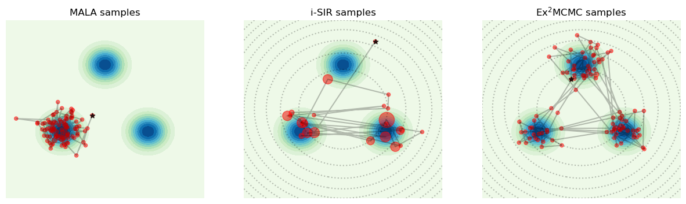

#### Sampling from GAN as Energy-Based Models with MCMC

Metrics:

 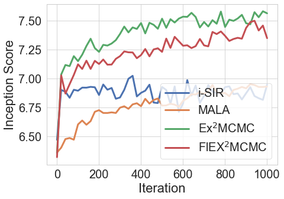 
<!-- 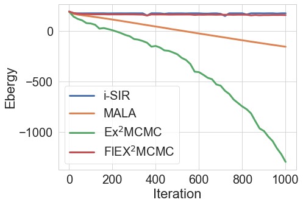  -->


Samples: 

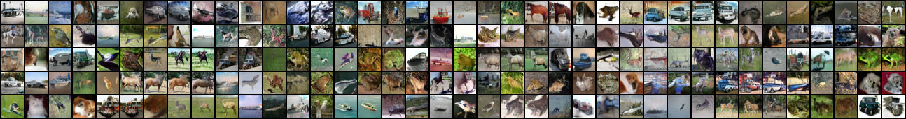


### Algorithms 
<!-- **i-SIR:**

 -->

**Ex<sup>2</sup>MCMC:**

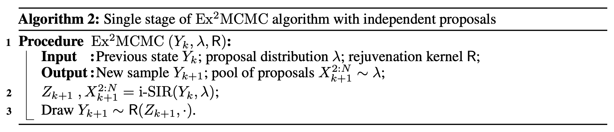2</sup>MCMC" width="600"/>

**FlEx<sup>2</sup>MCMC:**

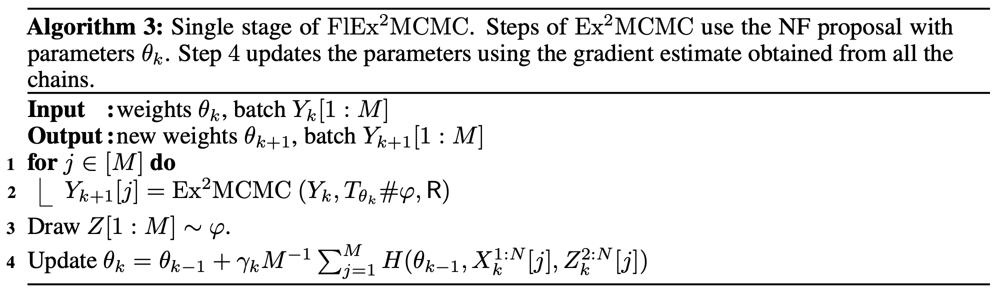2</sup>MCMC" width="600"/>

### Requirements

* Python >= 3.8
* PyTorch >= 1.8.0
* torchvision
* pyro-ppl
* Jax
* POT

### Installation

Create environment:

```bash
conda create -n ex2mcmc python=3.8
conda activate ex2mcmc
```

```bash
pip install ex2mcmc
pip install git+https://github.com/kwotsin/mimicry.git
```

#### Developement installation

Install poetry (if absent):
```bash
curl -sSL https://install.python-poetry.org | python3 -
poetry config virtualenvs.create false
```

Install the project:
```bash
poetry install --with dev
poetry add git+https://github.com/kwotsin/mimicry.git@a7fda06c4aff1e6af8dc4c4a35ed6636e434c766
```

#### Download checkpoints and stats

CIFAR10 checkpoints:

| GAN   |     Steps     |  Path, G |  Path, D |
|:----------|:-------------:|:------:|:------:|
| DCGAN NS  | 100k      |   [netG_100000_steps.pth](https://drive.google.com/file/d/1gv8_qr_xa8hJzdJpBXiKr8v922EqcE-E/view?usp=share_link) |   [netD_100000_steps.pth](https://drive.google.com/file/d/1u1sPUmlvyhcbNDX2DVsR-mGOzqQ6U8sh/view?usp=share_link) |
| SNGAN, Hinge  | 100k      |   [netG.pth](https://drive.google.com/file/d/118zC_iEkN27jGLVNmDuQpMeyw7BKOUra/view?usp=share_link) |   [netD.pth](https://drive.google.com/file/d/1xU5FV59TLhAlkFubJGmJVS87HnZZ2xHT/view?usp=share_link) |

MNIST checkpoints:

| GAN      |  Path |
|:----------|:-------------:|
| Vanilla  |   [vanilla_gan.pth](https://drive.google.com/file/d/1xa1v4hPQQdU2RkhjMn5sFZCITxTJ5Dhj/view?usp=share_link) |
| WGAN CP  |   [wgan.pth](https://drive.google.com/file/d/17nQJnfs2_T6kyahnkW3fu8AVY54kmRmw/view?usp=share_link) |

You also can run script to download checkpoints:

```bash
chmod +x get_ckpts.sh
./get_ckpts.sh
```

Download statistics for FID cimputation for CIFAR10 dataset:

```bash
mkdir -p stats & gdown 1jjgB_iuvmoVAXPRvVTI_hBfuIz7mQgOg -O stats/fid_stats_cifar10.npz
```

<!-- | WGAN GP   | --        |   [TBD]() |   [TBD]() | -->

### Usage

#### Demonstration on SNGAN

Try with colab:  [](https://colab.research.google.com/drive/1EQQ_OdwCLn5MsOzlG-GS7yNcjTBU-KMp?usp=sharing)

#### Experiments with synthetic distributions:

FlEx<sup>2</sup>MCMC  vs     NUTS:

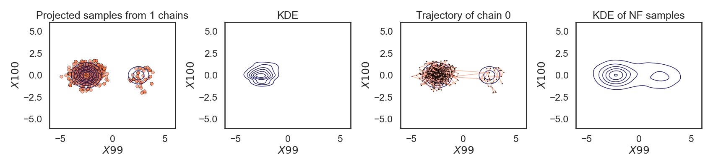2</sup>MCMC" width="600"/> 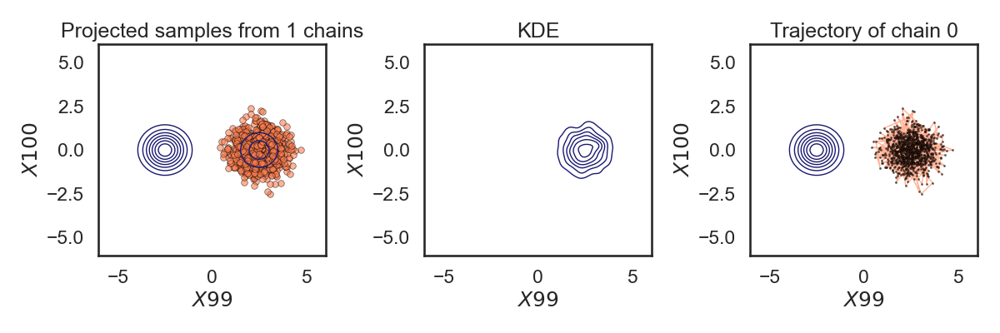

  
| Experiment | Path | Colab |
|:----------|:-------|:-----:|
| Toyish Gaussian   |     ```experiments/exp_synthetic/toyish_gaussian.ipynb``` | [TBD]() |
| Gaussian mixture  |     ```experiments/exp_synthetic/gaussian_mixture.ipynb``` | [](https://colab.research.google.com/drive/1xmBOZr1YhN8E7Y8GuwjgdM7hqaCgE6ik?usp=sharing) |
| FlEx for Mixture of Gaussians          |   ```experiments/exp_synthetic/flex_mog.ipynb```    | [](https://colab.research.google.com/drive/1Cy3Ion97F1kIWMNkF6wl-XODnfP9VQ5u?usp=sharing) |
| FlEx for banana-shaped distribution   |     ```experiments/exp_synthetic/flex_banana.ipynb``` | [](https://colab.research.google.com/drive/16ZjJH8id__6aPPeCPFEQXO86kvFBO1wb?usp=sharing) |
| FlEx for Neal's funnel distribution   |     ```experiments/exp_synthetic/flex_funnel.ipynb``` | [](https://colab.research.google.com/drive/15MwmA3kY7sSPmk2i3mm1TUc_Vg-AJC8g?usp=sharing) |

To reproduce the experimets on banana-shaped and funnel distributions:

```bash
python experiments/exp_synthetic/banana_funnel_metrics.py --distribution {banana,funnel} --device cuda:0
```

 #### Experiments with GANs on MNIST dataset
 
 ```experiments/exp_mnist/JSGAN_samples.ipynb``` [TBD]()

 ```experiments/exp_mnist/WGAN_samples.ipynb``` [](https://colab.research.google.com/drive/1aarHEdILfnR-vB0j7NN4uBurti08BtZk?usp=sharing)

 #### Experiments with GANs on CIFAR10 dataset

```experiments/exp_cifar10_demo/DCGAN_samples.ipynb``` 

<!-- []() -->

```experiments/exp_cifar10_demo/SNGAN_samples.ipynb``` 

<!-- []() -->

#### Sampling and FID computation

```bash
python experiments/exp_cifar10_fid/run.py configs/mcmc_configs/{ula,mala,isir,ex2mcmc,flex2mcmc}.yml configs/mmc_dcgan.yml
```

To run a full experiment:

```bash
chmod +x experiments/exp_cifar10_fid/run.sh & ./experiments/exp_cifar10_fid/run.sh
```

### Results

#### FID and Inception Score (CIFAR10)
| GAN | MCMC | Steps | Inception Score | FID  |
|:----|:-----|:------:|:---------------:|:----:|
|DCGAN| none | 0     |       6.3          |  28.4    |
|DCGAN| i-SIR  | 1k     |    6.96          |  22.7    |
|DCGAN| MALA  | 1k      |    6.95           |   23.4   |
|DCGAN| Ex<sup>2</sup>MCMC (our)  | 1k   |    <ins>7.56<ins>          |   <ins>19.0<ins>   |
|DCGAN| FlEx<sup>2</sup>MCMC (our)  | 1k |    **7.92**          |  19.2    |
|DCGAN| FlEx<sup>2</sup>MCMC (our) | 180 |   7.62      |  **17.1**    |


#### Energy landscape approximation (MNIST)

Projection of GAN samples onto the energy landsape when trained on MNIST dataset:

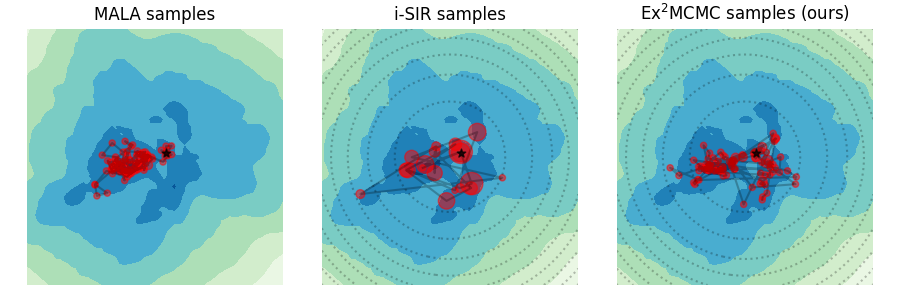 


#### Sampling trajectories (CIFAR10)
Generation trajectories for DCGAN.

<!-- , top to bottom: ULA, MALA, i-SIR, Ex<sup>2</sup>MCMC, FlEx<sup>2</sup>MCMC: -->

<!-- 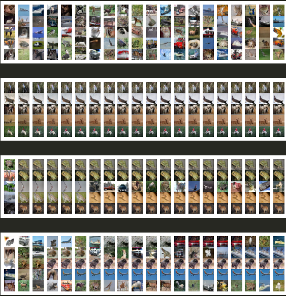  -->

* ULA:

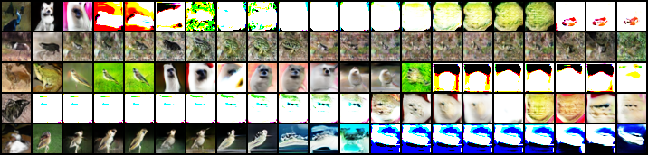 

* MALA:

 

* i-SIR:

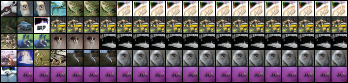 

* Ex<sup>2</sup>MCMC:

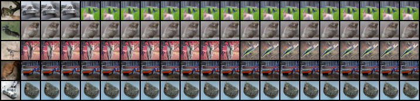 

* FlEx<sup>2</sup>MCMC:

 

### Citation

```bibtex
@article{samsonov2022local,
  title={Local-Global MCMC kernels: the best of both worlds},
  author={Samsonov, Sergey and Lagutin, Evgeny and Gabri{\'e}, Marylou and Durmus, Alain and Naumov, Alexey and Moulines, Eric},
  journal={Advances in Neural Information Processing Systems},
  volume={35},
  pages={5178--5193},
  year={2022}
}
```


